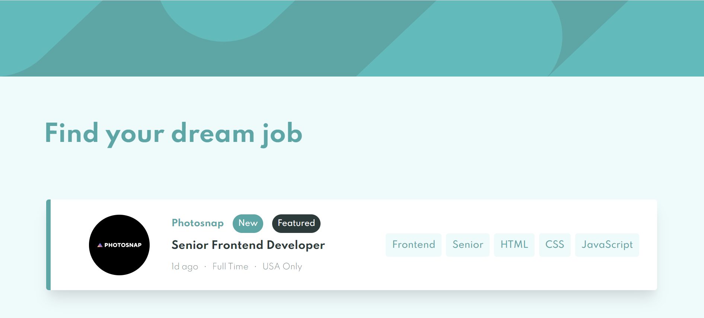

# Job-Listing-With-Filtering

This is a solution to the [Job Listings with Filtering Challenge on Frontend Mentor](https://www.frontendmentor.io/challenges/job-listings-with-filtering-ivstIPCt). Frontend Mentor challenges help you improve your coding skills by building realistic projects.

## Table of Contents

- [Overview](#overview)
  - [The Challenge](#the-challenge)
  - [Screenshot](#screenshot)
  - [Links](#links)
- [My Process](#my-process)
  - [Built With](#built-with)
  - [What I Learned](#what-i-learned)
  - [Code Snippet](#code-snippet)
- [Author](#author)

## Overview

### The Challenge

Users should be able to:

- View the optimal layout for the site depending on their device's screen size
- See hover states for all interactive elements on the page
- Filter job listings based on the categories

### Screenshot

Desktop View

### Links

- Solution URl: [Solution Site]()
- Live Site URL: [Live Site]()

## My Process

### Built With

- Semantic HTML5 Markup
- Flexbox
